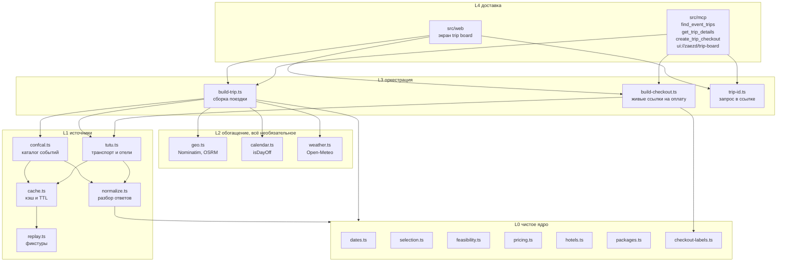
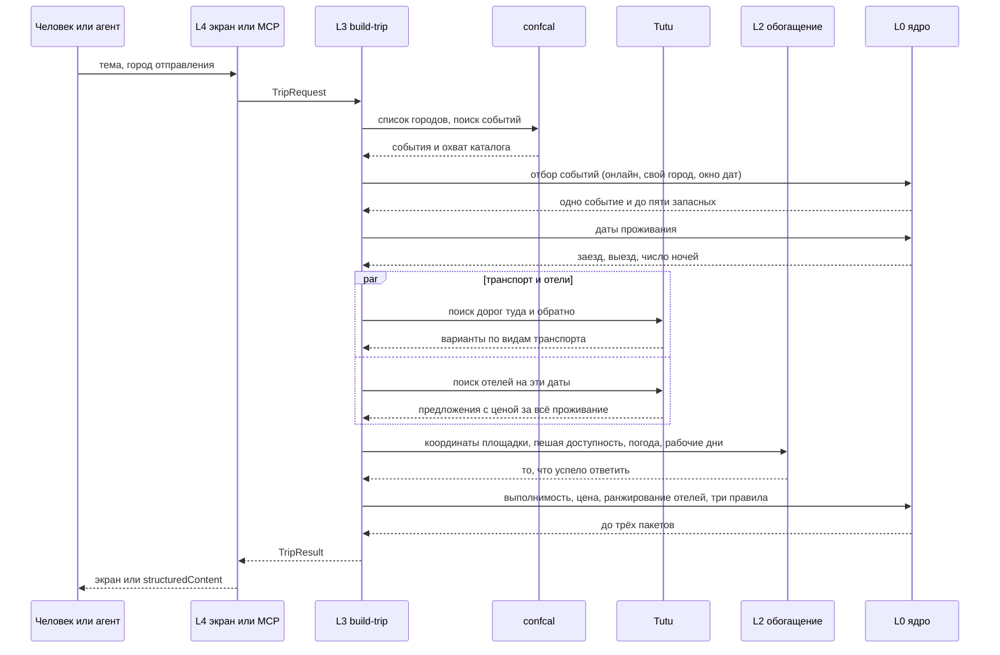
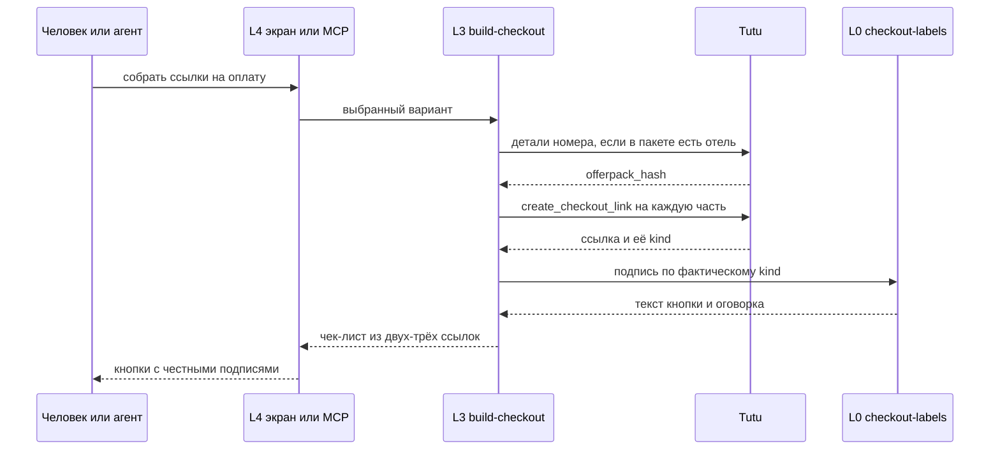

# Архитектура

Одна схема компонентов и две последовательности. Решения с обоснованиями лежат отдельно, в
[decisions.md](decisions.md); здесь только то, как всё устроено.

## Компоненты

Зависимости идут только вниз. Ни один модуль L0 не знает про сеть, часы и формат ответов
источников; ни один модуль L4 не считает даты и цены. Именно поэтому чистое ядро проверяется
юнит-тестами без единого мока.

## Сборка поездки

Что происходит, когда человек открывает экран или агент зовёт `find_event_trips`.

Обогащение никогда не ломает сборку. Каждый источник L2 живёт со своим таймаутом, а его отказ
превращается в отсутствующий блок и строку про то, какой именно источник не ответил.

## Оплата

Ссылки собираются в момент нажатия, а не при сборке поездки: `checkout_ref` и `search_id`
живут недолго.

Если живой вызов не удался, Заезд отдаёт страницу поиска Туту и подписывает кнопку именно так.
Корзину заводит сам человек в своей сессии: это модель Туту, а не деталь реализации.

## Два канала, один рендерер

Экран и MCP App рисует один и тот же код в `src/web/client/`. Отличается только то, откуда
приходят данные и кто имеет право действовать.

| | Экран в браузере | MCP App в хосте |
|---|---|---|
| Данные | встроены сервером в документ | приходят от хоста в `ui/notifications/tool-result` |
| Пересборка | форма на своём origin | `tools/call` через хост |
| Открытие ссылки | обычная ссылка | `ui/open-link` через хост |
| Тема | системная настройка | то, что сообщил хост |

Внутри хоста страница живёт в песочном iframe под строгим CSP и своего origin не имеет.
Поэтому статика отдаётся с `Access-Control-Allow-Origin: *`, иначе модульный скрипт не
загрузится и доска останется пустой при полностью рабочем вебе.

## Состояние

Состояния поездки на сервере нет. `trip_id` - это компактная запись самого запроса
(`v1.` плюс base64url канонического JSON), поэтому `/t/:id` пересобирает поездку из ссылки, а
перезапуск сервера ничего не стоит ни человеку, ни агенту.

Кэш живёт в памяти процесса, у каждого источника свой TTL. Ссылки на оплату не кэшируются
никогда.
